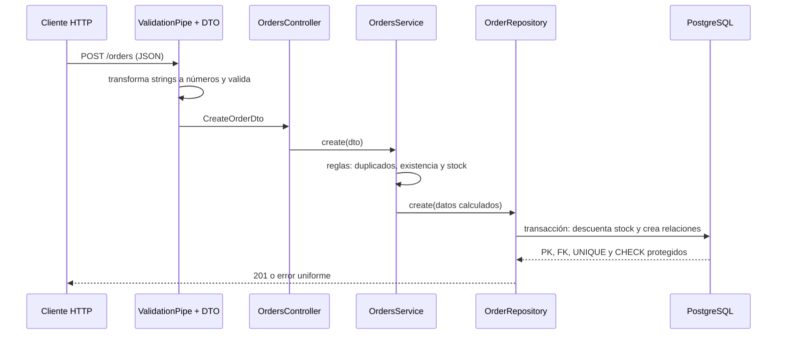

# Ciclo de solicitud: API de pedidos

API educativa en TypeScript con NestJS, PostgreSQL y Prisma. La operación `POST /orders` valida y transforma la entrada, aplica reglas de negocio, persiste un pedido con sus detalles en una transacción y devuelve errores con una estructura uniforme.

## Evolución demostrada

La migración inicial guarda `Order.totalCents`. La segunda migración agrega `OrderItem` y transforma de forma segura los pedidos existentes:

1. **Expandir:** crea `OrderItem`, su clave primaria, claves foráneas, índice único y restricciones `CHECK`.
2. **Migrar:** crea idempotentemente un producto técnico y convierte cada total histórico en un detalle equivalente.
3. **Validar:** un bloque SQL aborta la transacción si algún pedido quedó sin detalle.
4. **Contraer:** elimina `Order.totalCents` después de preservar la información; el total se calcula desde los detalles.

No se usa `prisma db push` ni sincronización directa. El SQL revisado está en [`prisma/migrations`](prisma/migrations).

## Arquitectura y recorrido



El controlador solo adapta HTTP. `OrdersService` contiene el caso de uso y reglas. La interfaz `OrderRepository` desacopla el caso de uso. `PrismaOrderRepository` contiene consultas y la transacción. `ApiExceptionFilter` entrega siempre `statusCode`, `code`, `message`, `path` y `timestamp`.

## Requisitos y variables

- Node.js 20 o superior
- Docker con Compose, o PostgreSQL 16 accesible
- `DATABASE_URL`: conexión PostgreSQL, requerida
- `PORT`: puerto HTTP, opcional; predeterminado `3000`

```bash
cp .env.example .env
npm install
docker compose up -d
npx prisma migrate deploy
npx prisma db seed
npm run start:dev
```

El `.env` está ignorado y el repositorio solo incluye `.env.example` con valores locales de ejemplo.

## Operación HTTP

Los campos numéricos se pueden enviar como números o strings; `ValidationPipe` y `@Type(() => Number)` los transforman antes del controlador.

```bash
curl -X POST http://localhost:3000/orders \
  -H "Content-Type: application/json" \
  -d '{"customerId":"1","externalCode":"WEB-001","items":[{"productId":"2","quantity":"2"}]}'
```

Respuesta esperada: HTTP `201`, detalle relacionado y `totalCents` calculado. Envíe `quantity: 0` para comprobar HTTP `400`. PostgreSQL también aplica `CHECK (quantity > 0)`, incluso si se intenta evitar la API.

## Seed reproducible e idempotente

`prisma/seed.ts` usa `upsert` sobre claves únicas estables (`email`, `sku`, `externalCode` y la clave compuesta del detalle). Ejecutarlo varias veces actualiza los mismos registros y no genera duplicados:

```bash
npx prisma db seed
npx prisma db seed
```

## Reconstrucción y verificación desde una base vacía

Use solamente una base local descartable. Este comando elimina su contenido, aplica **todo** el historial, ejecuta el seed dos veces para comprobar idempotencia y recorre la API y una restricción de base:

```bash
npm run verify:fresh
```

La salida termina en `VERIFICACIÓN COMPLETA: OK` y demuestra: seed mínimo, validación 400, transformación de strings, respuesta 201, relación persistida y rechazo de `quantity=0` por PostgreSQL.

También se puede inspeccionar el historial con:

```bash
npx prisma migrate status
```

## Desarrollo frente a despliegue

En desarrollo, `npx prisma migrate dev --name descripcion` compara el esquema, genera una migración nueva y la aplica a la base local. Si una migración aplicada necesita corrección, se agrega otra migración; nunca se reescribe el historial.

En integración, staging o producción, el artefacto ya contiene las migraciones revisadas. Se configura `DATABASE_URL` mediante el gestor de secretos y se ejecuta `npx prisma migrate deploy`. Ese comando solo aplica migraciones pendientes: no genera SQL, no reinicia la base y no ejecuta el seed automáticamente. El seed se ejecuta de forma explícita solo cuando los datos mínimos sean parte del despliegue.

## Restricciones protegidas por PostgreSQL

- Claves primarias en todas las tablas.
- Claves foráneas `Order → Customer` y `OrderItem → Order/Product`.
- Unicidad de correo, SKU, código externo y `(orderId, productId)`.
- `quantity > 0`, `unitPriceCents >= 0`, `priceCents >= 0`, `stock >= 0`.
- Estado limitado a `PENDING`, `CONFIRMED` o `CANCELLED`.

## Comandos útiles

| Objetivo | Comando |
|---|---|
| Compilar | `npm run build` |
| Desarrollo | `npm run start:dev` |
| Crear migración local | `npm run db:migrate:dev -- --name nombre` |
| Aplicar historial en despliegue | `npm run db:migrate:deploy` |
| Ejecutar seed | `npm run db:seed` |
| Ver estado | `npm run db:status` |
| Reconstruir y verificar | `npm run verify:fresh` |
